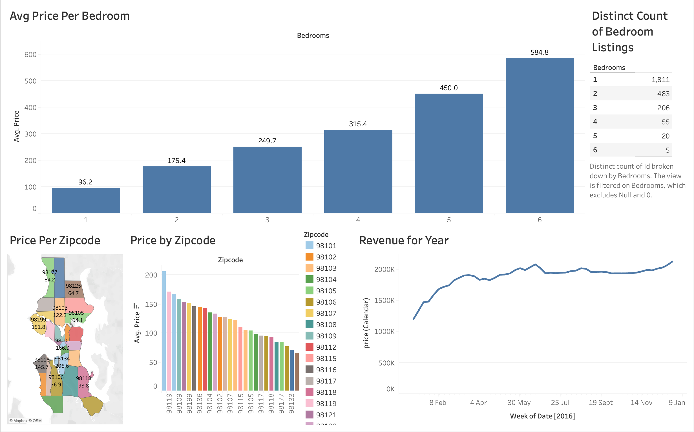

📘 Introduction

This Tableau dashboard provides a visual analysis of Airbnb listings in Seattle for 2016. It explores pricing patterns, listing distributions, and geographical variations to uncover insights about the Airbnb market.

🎯 Background

This project was inspired by Alex Freberg's Tableau tutorial on YouTube, which guided me through building interactive dashboards and storytelling with data.

📺 Watch the tutorial [link text](https://www.youtube.com/watch?v=j8FSP8XuFyk)

📊 Dataset source: [link text](https://www.kaggle.com/datasets/alexanderfreberg/airbnb-listings-2016-dataset)

❓ Key Questions Explored

1.  What is the average price per bedroom across listings?
2.	How many listings exist for each bedroom type?
3.	Which zip codes have the highest and lowest average prices?
4.	How does revenue trend throughout the year?
5.	What geographical insights can we gain from Airbnb pricing distribution?

🧰 Tools I Used

•	🟢 Tableau Desktop - for dashboard creation and visualization
•	🧾 Excel / CSV - for data preprocessing
•	🌐 Kaggle - as the data source
•	💻 GitHub - to share and document this project

📊 The Analysis

1.🛏️ Average Price per Bedroom

A bar chart shows that average price increases with the number of bedrooms — from $96.2 for 1-bedroom listings up to $584.8 for 6-bedroom properties.

2.🏘️ Distinct Count of Bedroom Listings

Most listings are 1-bedroom (1,811), while larger homes (5-6 bedrooms) make up only a small portion of the market.

3.🗺️ Price per Zipcode (Map)

A geographical visualization reveals price clusters across Seattle, where premium areas such as 98134 and 98119 command higher average prices.

4.📊 Price by Zipcode (Bar Chart)

A ranked bar chart highlights pricing differences by location, emphasizing how certain neighborhoods significantly outperform others.

5.📆 Revenue for Year (Line Chart)

A time-series line chart shows seasonal trends, with revenue rising in early months, peaking mid-year, and stabilizing towards year-end.

🧠 What I Learned

Through this mini project, I developed key Tableau and data visualization skills, including:

•	🔹 Connecting Tableau to different data sources (CSV files)
•	🔹 Performing data cleaning and table joins in Tableau
•	🔹 Building and combining multiple views into one interactive dashboard
•	🔹 Creating maps and geo-based visualizations using zip codes
•	🔹 Designing for clarity, consistency, and storytelling
•	🔹 Interpreting and communicating data-driven insights effectively

💡 Conclusion

📈 Insights

•	Listings with more bedrooms have higher average prices, following a clear upward trend.
•	The majority of properties are 1-bedroom listings, indicating a market preference for smaller spaces.
•	Zip codes 98134 and 98119 are among the most expensive areas in Seattle.
•	Revenue peaks mid-year, reflecting strong seasonal demand.

💬 Closing Thoughts

This project enhanced my ability to turn raw data into meaningful stories. I learned how to use Tableau to explore, analyze, and visualize data effectively — a skill that bridges both technical analysis and visual communication.

